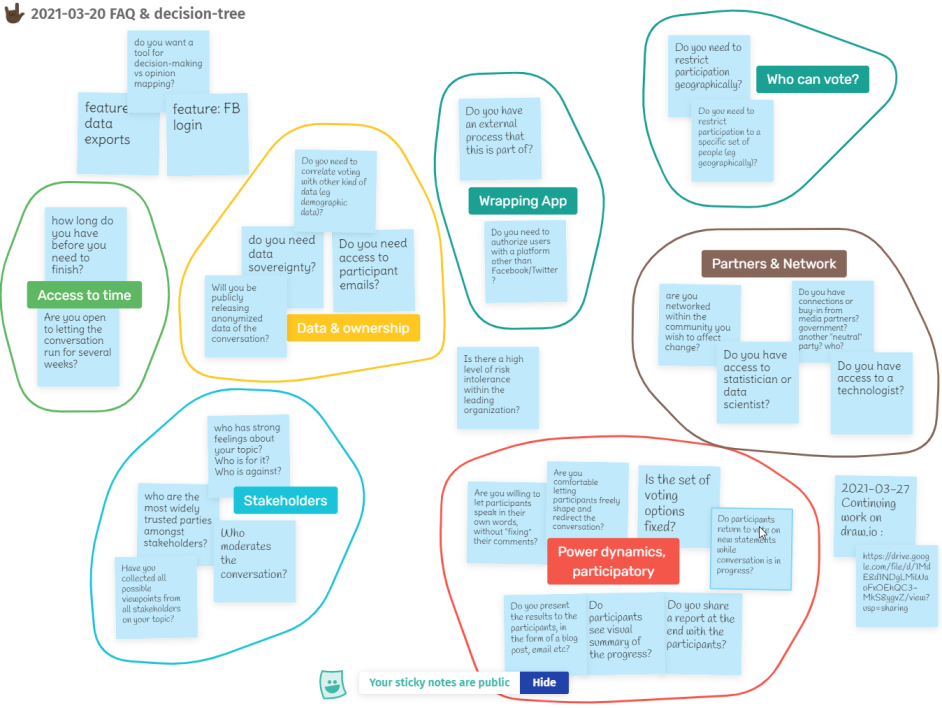
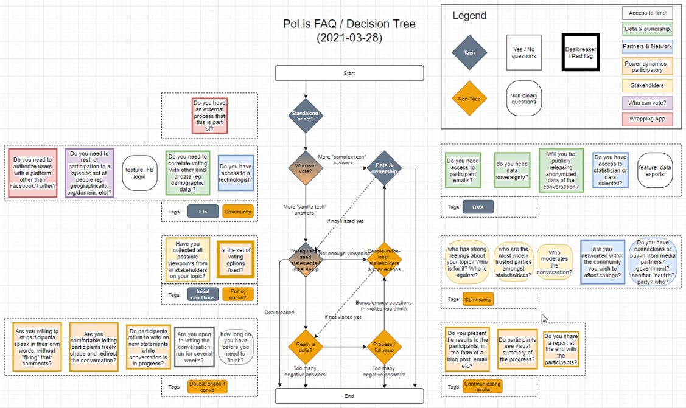
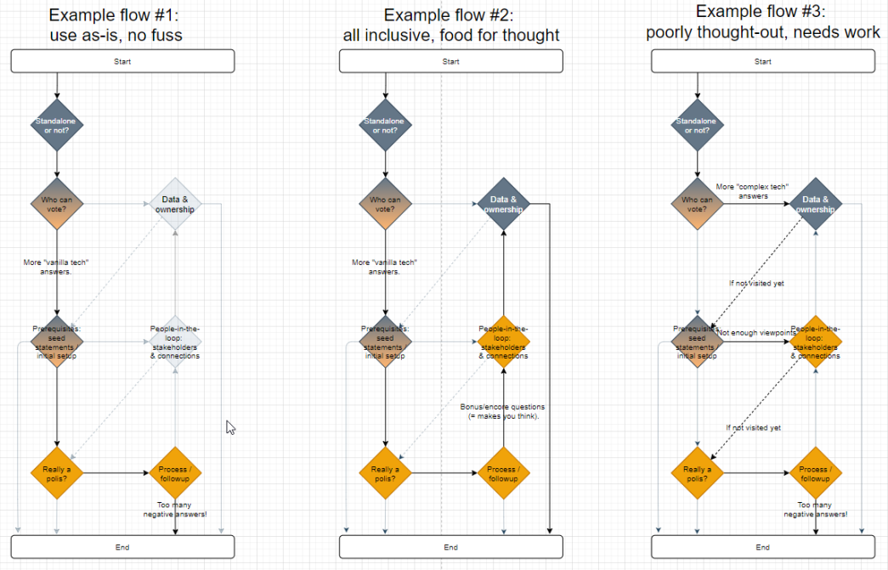

# Polis FAQ Adventure

## What
Material for a Pol.is FAQ, structured as a text adventure.

## Where
* :writing_hand: Contribute: this repo - create a PR or check the current state of the project.
* :speech_balloon:	Discuss: https://discord.gg/gkt7HgrN5C

## Why
During discussion, the need for a litmus test / guiding FAQ for [Pol.is](https://pol.is), came up. 

One that could help people who are interested in using Pol.is to figure out whether 
* :wrench: it's the right tool for them, 
* :thought_balloon:	they have thought-out their use case,
* :see_no_evil:	they have a clear overview of the process,
* etc

Essentially a FAQ on steroids 🙂. Maybe even an attempt at semi-automated, early-stage facilitation :gear:	:raising_hand:	.

And why not a text adventure? :speech_balloon: :left_speech_bubble:		

## How
* :brain:	Brainstormed with @[patcon](https://github.com/patcon) on some good questions
  * 

    
(these ones)

  
    
    

* :bouquet:	Bundled the questions together in themes and arranged them in a flow/decision tree [(here)](./Polis_FAQ_Decision_tree.drawio)
  * 

    
(like this)

  
    
    
    

* :speech_balloon: The flow is slowly being turned into a text adventure, using the [ink scripting](https://www.inklestudios.com/ink/) language [(here)](./Polis_FAQ_Adventure.ink)

## To Do
* More meaningful feedback to the user/player is needed at every step.
  * E.g currently the player is asked *Do you need to authorize users with a platform other than Facebook/Twitter?* , the choice is saved for later use and the response is *Great!*. 
  * A better/more useful response would be e.g. *That's great, but you should be aware that you need to host your own Pol.is instance, and put the necessary technical effort to integrate with your preferred authorization method* etc
